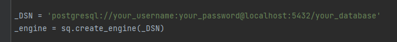
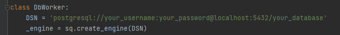
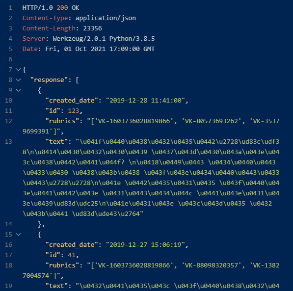
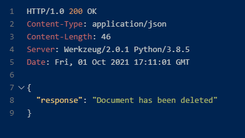

# Инструкция по запуску

## 1) Elasticsearch
Для начала запускаем сервер Elasticsearch у себя на машине.

## 2) models.py
Затем создаем модели в базе данных. Для этого запускаем *models.py* со своими
данными для подключения к БД.

## 3) db_worker.py
Здесь тоже указываем свой путь для подключения к базе данных и запускаем скрипт. После этого
данные из csv-файла загрузятся в БД.

## 4) elasticsearch_worker.py
Запускаем этот скрипт, чтобы все данные так же загрузились и в индекс. Придется немного 
подождать.

## 5) app.py
Запускаем *app.py*, и все готово! Теперь можно начинать работать с сервером.

# Примеры запросов и ответы на них:
### GET - запрос

### DELETE - запрос

